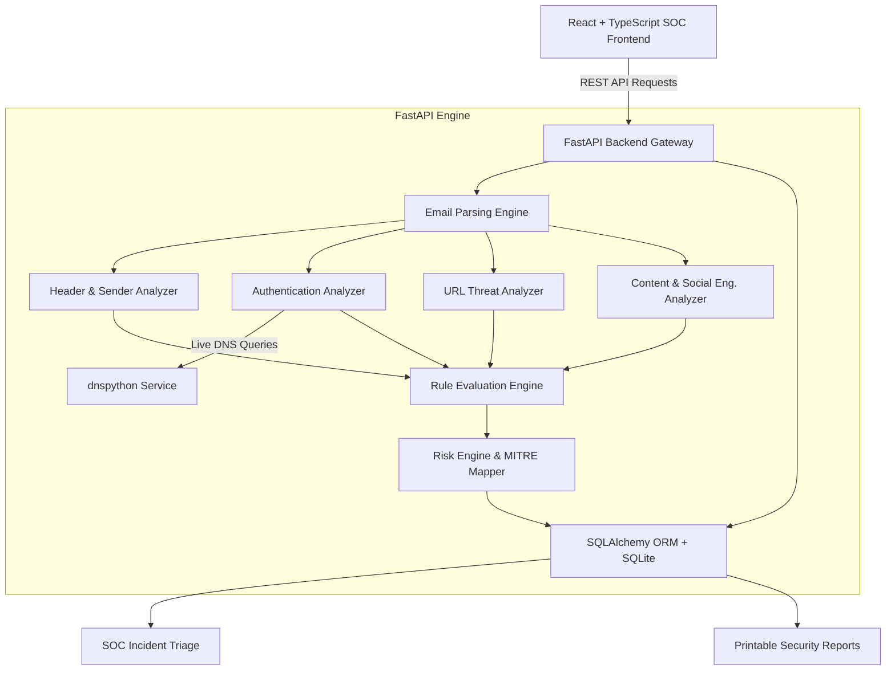

# PhishGuard System Architecture

## Architecture Overview

**PhishGuard** employs a clean modular, asynchronous architecture designed for high-performance email threat inspection, rule evaluation, SOC incident management, and explainable risk reporting.

---

## Component Breakdown

### 1. Frontend Layer (`/frontend`)
- **Technology**: React 18, TypeScript, Vite, Tailwind CSS v4, Recharts, Lucide React icons.
- **Role**: Presents SOC analysts with intuitive views including Executive Landing Page, Real-Time Dashboard, Dual-Input Analysis Engine (Paste RFC822 / Upload `.eml`), Explainable Risk Result Page, Analysis History, Incident Triage Manager, and Printable Security Reports.

### 2. API Gateway & Routing (`/backend/app/api`)
- **Technology**: FastAPI, Pydantic v2, CORS Middleware.
- **Role**: Validates payloads, handles file upload boundaries (up to 10MB), manages async execution, and routes requests to core analysis services.

### 3. Email Parsing Service (`/backend/app/services/email_parser.py`)
- **Technology**: Python `email.parser`, `decode_header`, `BeautifulSoup4`.
- **Role**: Safely parses MIME structure, extracts headers (From, Reply-To, Return-Path, Received, Authentication-Results), extracts plain text and HTML bodies, and isolates embedded URLs and anchor display text without executing scripts.

### 4. Modular Security Analyzers (`/backend/app/analyzers`)
- `header_analyzer.py`: Checks sender vs Reply-To mismatches and relay hops.
- `sender_analyzer.py`: Detects brand impersonation (Microsoft, PayPal, Google, Amazon, etc.).
- `authentication_analyzer.py`: Queries DNS TXT records for SPF (`v=spf1`) and DMARC (`_dmarc.<domain>`), parses Authentication-Results headers, and evaluates protocol status.
- `url_analyzer.py`: Identifies IP hosts, URL shorteners, display text domain mismatches, excessive subdomains, non-standard ports, and obfuscated percent encoding.
- `content_analyzer.py`: Regex pattern matching for urgency language, credential harvesting, and financial wire demands.

### 5. Detection & Risk Engine (`/backend/app/detection`)
- `rules.py`: Central catalog of rule IDs, base severity scores, and official MITRE ATT&CK technique mappings (`T1566.002`, `T1036`, `T1071.001`, `T1586`).
- `risk_engine.py`: Aggregates rule weights, deduplicates repeat rule triggers, normalizes scores into a 0-100 scale, maps scores into Risk Levels (`LOW`, `MEDIUM`, `HIGH`, `CRITICAL`), and generates remediation recommendations.

### 6. Persistence & ORM Layer (`/backend/app/database`)
- **Technology**: SQLite, SQLAlchemy ORM.
- **Role**: Manages tables for `analyses`, `authentication_results`, `extracted_urls`, `risk_indicators`, and `incidents`.
