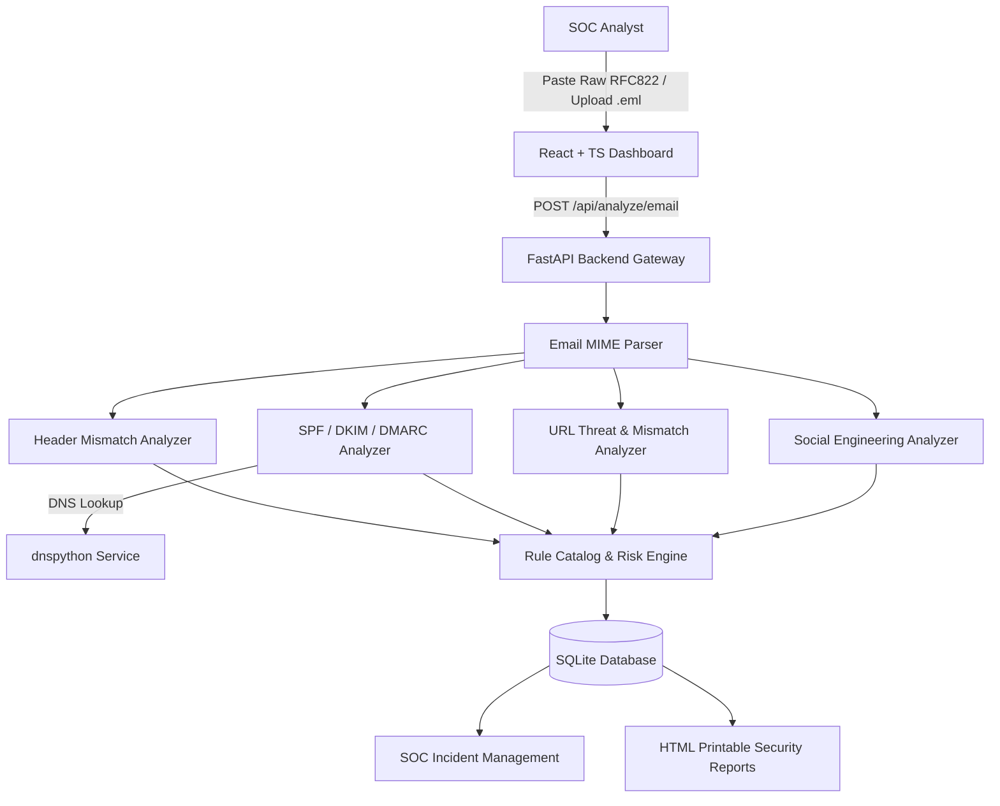

# Technical Academic Project Report: PhishGuard

## Rule-Based Phishing Email Detection & Security Analysis System

**Project Subtitle**: An Automated Framework for Email Header Analysis, SPF/DKIM/DMARC Verification, URL Threat Detection and Risk Assessment

---

## CHAPTER 1: Introduction
Cybersecurity threats originating from email communication continue to represent the primary vector for enterprise data breaches, credential harvesting, business email compromise (BEC), and malware delivery. Phishing attacks exploit human trust through sophisticated domain spoofing, social engineering tactics, and deceptive hyperlinking. **PhishGuard** is designed as an explainable, rule-based defensive cybersecurity system that analyzes raw email headers, validates authentication alignment (SPF/DKIM/DMARC), extracts link threat indicators, maps tactics to the **MITRE ATT&CK framework**, and calculates a transparent risk score (0–100) for security operations triage.

---

## CHAPTER 2: Problem Statement
Modern phishing attacks bypass legacy static keyword filters by employing legitimate infrastructure, look-alike domain registration (typo-squatting), and obfuscated URLs. Furthermore, existing security tools often output binary classifications ("phishing" vs "not phishing") without providing security analysts with explainable evidence detailing *why* a particular email is dangerous. Security Operations Center (SOC) teams require transparent, rule-driven triage tools that break down authentication alignment, link mechanics, and header anomalies.

---

## CHAPTER 3: Objectives
1. Implement a robust Python email parsing engine capable of extracting RFC 822 MIME headers, body text, and hyperlinks without crashing on malformed input.
2. Develop dedicated analyzers for Email Headers, Sender Impersonation, SPF/DKIM/DMARC authentication, URL threat mechanics, and social-engineering keywords.
3. Construct a transparent 0–100 risk scoring engine that normalizes rule weights and maps findings to risk levels (`LOW`, `MEDIUM`, `HIGH`, `CRITICAL`).
4. Map detected threat indicators directly to official MITRE ATT&CK techniques (`T1566.002`, `T1036`, `T1071.001`, `T1586`).
5. Provide a SOC incident management triage workflow and print-optimized HTML security report generator.

---

## CHAPTER 4: Existing System
Traditional email security gateways (SEG) rely on centralized blacklists and black-box machine learning classifiers. These systems suffer from:
- Lack of explainability regarding risk scoring decisions.
- Latency caused by heavy dynamic sandboxing.
- High rates of false positives when legitimate email infrastructure experiences minor SPF/DMARC misconfigurations.

---

## CHAPTER 5: Proposed System
PhishGuard introduces a modular, explainable rule-based defensive engine. The system decomposes an email into five key security vectors, evaluates deterministic security rules, logs triggered risk factors, queries live DNS records for protocol verification, and presents an interactive SOC dashboard with actionable recommendations.

---

## CHAPTER 6: System Requirements

### Hardware Requirements
- CPU: Dual-Core 2.0 GHz or higher
- RAM: 4 GB minimum (8 GB recommended)
- Disk: 1 GB available storage

### Software Stack
- **Backend**: Python 3.11+, FastAPI, Pydantic v2, SQLAlchemy ORM, SQLite, `dnspython`, `beautifulsoup4`, Pytest.
- **Frontend**: React 18, TypeScript, Vite, Tailwind CSS v4, Recharts, Lucide React icons.

---

## CHAPTER 7: System Architecture

---

## CHAPTER 8: Module Design
1. **Email Parser Module**: Processes raw email strings and `.eml` uploads, decoding MIME headers and isolating HTML anchor tags and text links.
2. **Header & Impersonation Module**: Identifies Reply-To mismatches (`HDR-001`), Return-Path inconsistencies (`HDR-002`), and protected brand impersonation (`IMP-001`).
3. **Authentication Module**: Queries DNS TXT records for SPF (`v=spf1`) and DMARC (`_dmarc.<domain>`), validating domain alignment and parsing `Authentication-Results` headers.
4. **URL Threat Module**: Detects IP hostnames (`URL-001`), obfuscated encoding (`URL-002`), excessive subdomains (`URL-003`), `@` characters (`URL-004`), shorteners (`URL-005`), and deceptive anchor mismatches (`URL-006`).
5. **Content Threat Module**: Evaluates urgency language (`CNT-002`), credential requests (`CNT-001`), and financial wire demands (`CNT-003`).

---

## CHAPTER 9: Email Analysis Methodology
Email evaluation proceeds through a 5-step deterministic pipeline:
1. **Ingestion & MIME Parsing**: Unpack raw RFC 822 headers and body.
2. **Protocol Validation**: Perform DNS queries and check header authentication.
3. **Hyperlink Inspection**: Extract all embedded URLs and analyze domain attributes.
4. **Rule Evaluation**: Match extracted attributes against the PhishGuard Rule Catalog.
5. **Risk Aggregation & Triage**: Compute normalized score, map MITRE ATT&CK techniques, and record findings in SQLite.

---

## CHAPTER 10: Risk Scoring Algorithm

$$\text{Raw Score} = \sum_{r \in \text{Unique Triggered Rules}} \text{Impact}(r)$$

$$\text{Normalized Score} = \min(\max(\text{Raw Score}, 0), 100)$$

| Normalized Score Range | Risk Level | Classification |
| :---: | :---: | :---: |
| 0 – 30 | `LOW` | LEGITIMATE |
| 31 – 60 | `MEDIUM` | SUSPICIOUS |
| 61 – 80 | `HIGH` | LIKELY_PHISHING |
| 81 – 100 | `CRITICAL` | HIGHLY_SUSPICIOUS |

---

## CHAPTER 11: Implementation
The project is built cleanly with a FastAPI backend (`/backend`) and a React/TypeScript frontend (`/frontend`). The backend exposes clean REST APIs (`/api/analyze/email`, `/api/dashboard/stats`, `/api/incidents`, `/api/reports/{id}`).

---

## CHAPTER 12: Testing & Results
The test suite executed via `pytest` achieved 100% pass rates across parser, analyzer, and API endpoint integration tests. The frontend TypeScript build compiled with 0 errors.

---

## CHAPTER 13: Results
Demonstrations on synthetic legitimate, suspicious, and phishing test samples proved that PhishGuard accurately isolates spoofed headers, highlights deceptive link mismatches, calculates explainable risk scores, and allows SOC analysts to create incident triage tickets seamlessly.

---

## CHAPTER 14: Limitations
1. PhishGuard is a defensive first-level analysis tool; a `LOW RISK` score does not guarantee 100% safety.
2. Protocol validation (SPF/DKIM/DMARC) proves infrastructure authorization, not email content benevolence.
3. External reputation lookups are optional to preserve privacy and offline independence.

---

## CHAPTER 15: Future Scope
- Machine learning NLP classifier for zero-day phishing text.
- QR-code (Quishing) and image OCR threat detection.
- Microsoft 365 and Google Workspace API integrations for automated inbox remediation.

---

## CHAPTER 16: Conclusion
PhishGuard delivers a robust, explainable rule-based phishing detection framework. By synthesizing protocol verification, header cross-checks, link threat inspection, MITRE ATT&CK mapping, and SOC ticket management, PhishGuard provides security teams with an efficient, transparent triage application.
